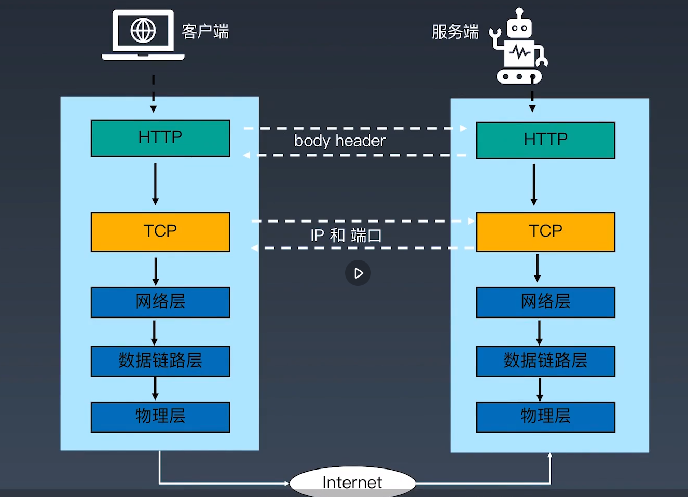
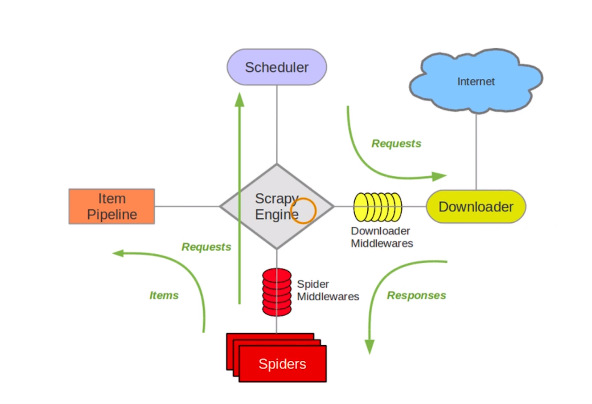

# 学习笔记（week one）


## week one 作业  

* [作业一](./maoyan_demo1.py)
* [作业二](./spiders/spiders/spiders/maoyanMovies.py)

***

## 使用python库获取豆瓣影评

#### 1、用requests写一个最简单的爬虫  

开发程序的四个步骤：**提出需求、编码、代码run起来，修复和完善**  
本篇的需求是爬取豆瓣的top250的电影数据

使用 [requests](https://requests.readthedocs.io/zh_CN/latest/) 库，伪造user-agent，来获取网页的源代码。当然requests不仅仅获取网页源码，还携带cookie，身份认证，代理支持，文件分块上传，下载等等很多的事情。

#### 2、使用BeautifulSoup解析爬取到的网页  
[Beautiful Soup](https://www.crummy.com/software/BeautifulSoup/bs4/doc.zh/) 是一个可以从HTML或XML文件中提取数据的Python库.它能够通过你喜欢的转换器实现惯用的文档导航,查找,修改文档的方式.Beautiful Soup会帮你节省数小时甚至数天的工作时间.

安装第三方库需要使用 **pip**，具体使用方法：
```bash
pip install other
```

或者使用此命令来迁移代码，如下命令：
```sheel
pip install -r requirements.txt
# requirements.txt 为约定俗成的文件名
```
这样，就能不同的机器或不同的环境下统一第三方包的版本了。

引入第三方库的方式：
```python
方式1
import package
方式2
from libray import package [as alias]
```

使用beautifulSoup库的例子：
```python
import requests
from bs4 import BeautifulSoup as b4


user_agent = 'Mozilla/5.0 (Windows NT 10.0; Win64; x64) AppleWebKit/537.36 (KHTML, like Gecko) Chrome/80.0.3987.163 Safari/537.36'
header = {'user-agent': user_agent}
myurl = 'https://movie.douban.com/top250'
respone = requests.get(myurl, headers=header,
                       auth=('15370383786', 'xxxx'))


bs_info = b4(respone.text, 'html.parser')

for tags in bs_info.find_all('div', attrs={'class': 'hd'}):
    for atag in tags.find_all('a', ):
        print(atag.get('href')) #获取所有连接
        print(atag.find('span',).text) #获取电影名称
```


#### 3、使用XPath解析网页  
lxml是处理XML和HTML的python语言，解析的时候，自动处理各种编码问题。而且它天生支持 XPath 1.0、XSLT 1.0、定制元素类。
安装：
```
    pip install lxml
```

```html
html 实例

<!DOCTYPE html>
<html>
<head>
<meta charset="utf-8">
<title>Study/title>
</head>
<body>

<h1>webpage</h1>
<p>source link</p>
<a href="http://www.runoob.com/html/html-tutorial.html" target="_blank">HTML</a> 
<a href="http://www.runoob.com/python/python-tutorial.html" target="_blank">Python</a>
<a href="http://www.runoob.com/cplusplus/cpp-tutorial.html" target="_blank">C++</a> 
<a href="http://www.runoob.com/java/java-tutorial.html" target="_blank">Java</a>
</body>
</html>


html（变量）， html.html（文件名）将被用于下面
```
用法：  
（1）HTML读取

```python
#直接读取
html = "html内容";
from lxml import etree
html = etree.HTML(html)
```
（2）获取标签
获取所有a标签，这种html内容有多种写法，可以直接得到4个元素
```python
# //a: 获取html下的所有a标签 
a_tags = html.xpath('//a')


# /html/body/a: 沿着节点顺序找a标签
a_tags = htmlObj.xpath('/html/body/a/text()')


# /descendant::a: 当前节点后代里面找a标签
a_tags = htmlObj.xpath('/descendant::a/text()')

```
xpath的选择器可以通过chrome浏览器的开发者工具里的 Elements选项卡在对应的html标签上右击选择copy XPath。  

Python Data Analysis Library 或 pandas 是基于NumPy 的一种工具，该工具是为了解决数据分析任务而创建的。Pandas 纳入了大量库和一些标准的数据模型，提供了高效地操作大型数据集所需的工具。pandas提供了大量能使我们快速便捷地处理数据的函数和方法。  
DataFrame：二维的表格型数据结构。很多功能与R中的data.frame类似。可以将DataFrame理解为Series的容器。

使用lxml 和 pandas 库的例子：
```python
import requests
import lxml.etree
url = "https://movie.douban.com/subject/1292052/"
userAgent = "Mozilla/5.0 (Windows NT 10.0; Win64; x64) AppleWebKit/537.36 (KHTML, like Gecko) Chrome/80.0.3987.163 Safari/537.36"

# 声明为字典使用字典的语法赋值
header = {}
header['user-agent'] = userAgent
response = requests.get(url, headers = header)

# print(response.text)
# xml化处理
selector = lxml.etree.HTML(response.text)

#电影名称
movieName = selector.xpath('//*[@id="content"]/h1/span[1]/text()')
print(f'电影名称：{movieName}')
#上映日期
date = selector.xpath('//*[@id="info"]/span[10]/text()')
print(f'上映日期：{date}')
#评分
score = selector.xpath('//*[@id="interest_sectl"]/div[1]/div[2]/strong/text()')
print(f'评分：{score[0]}')

details = [movieName[0], date[0], score[0]]
# print(details)
import pandas as pd
movieOne = pd.DataFrame(data = details)
movieOne.to_csv('./movieOne.csv', encoding = 'utf8', index = False, header = False)
```

#### 4、实现爬虫的自动翻页功能  

小结：
```python
import requests
from bs4 import BeautifulSoup as b4
from lxml import etree
import pandas as pd


def getCurrentPageByUrl(url):
    header = {
        'user-agent': "Mozilla/5.0 (Windows NT 10.0; Win64; x64) AppleWebKit/537.36 (KHTML, like Gecko) Chrome/80.0.3987.163 Safari/537.36"
    }
    response = requests.get(url, headers = header)
    htmlStr = response.text
    htmlObj = etree.HTML(htmlStr)
    # //*[@id="content"]/div/div[1]/ol/li[1]/div/div
    movieNames = htmlObj.xpath('//*[@id="content"]/div/div[1]/ol/li/div/div[2]/div/a/span[1]/text()')
    movieDetailUrls = htmlObj.xpath('//*[@id="content"]/div/div[1]/ol/li/div/div[2]/div[1]/a/@href')
    
    print(movieNames)
    print(movieDetailUrls)
    details = [movieNames, movieDetailUrls]
    data = pd.DataFrame(data = details)
    data.to_csv('./movieOne.csv', encoding = 'utf8', index = False, header = False, mode='a') # 追加写入文件


from time import sleep

url = "https://movie.douban.com/top250"

#生成所有页面的urls元祖
urls = tuple(f'https://movie.douban.com/top250?start={page * 25}' for page in range(10))
print(urls)
# getCurrentPageByUrl(url)

for url in urls:
    getCurrentPageByUrl(url)
    sleep(5)
```

#### 5、Python基础语法的回顾  

python的一些基础介绍
* [Python 简介](https://docs.python.org/zh-cn/3.7/tutorial/introduction.html)  
* [Python 数据结构](https://docs.python.org/zh-cn/3.7/tutorial/datastructures.html)  
* [Python 其他流程控制工具](https://docs.python.org/zh-cn/3.7/tutorial/controlflow.html)  
* [Python 中的类](https://docs.python.org/zh-cn/3.7/tutorial/classes.html)  
* [Python 定义函数](https://docs.python.org/zh-cn/3.7/tutorial/controlflow.html#defining-functions)


dir查看包里的所有函数名称  
help查看所有函数的用法

关键字：  
| | | | | | |
|:-:|:-:|:-:|:-:|:-:|:-:|
| False | True | None | class | type | and |  
| def | del | if | elif | else | as |
| break | continue | for | from | import | in |
| pass | not | is | or | return | try |
| except | while | assert | finally | nonlocal | lambda |
| raise | with | yield |  |  |  |

需要注意的是，不能使用关键来作为变量  

基本数据类型  
|数据类型|举例|
|-|-|
|整型（int）|-1、0、4|
|浮点型（float）|5.2、3.1415926|
|布尔值（bool）|False、True|
|空值|NULL|
|字符串（str）|‘geekbang’，‘4.5’|
|列表（list）|[1, 3, 5, 66, ]|
|元祖（tuple）|{1, 3, 7, 8, 48}|
|字典（dict）|{'a': 1, 'b': 3}|
|集合|{'apple', 'orange', 'banana', 'pear'}|


```python
#推导式写法

tuple(f'url?start={page * 25}' for page in range(10))

#展开写法
a = []
for page in range(10):
    a.append(f'url?start={page * 25}')
tuple(a)
```


#### 6、前端基础：HTML结构  
* HTTP协议与浏览器的关系  
* HTTP协议请求与返回头部  
* HTTP请求方式 get post delete put head  
* HTTP状态码  
* W3C标准  
* HTML常用标签和属性
* CSS、JavaScript、JSON简介
#### 7、前端基础：HTTP协议  
  
|HTTP状态码||
|--|--|
|1XX|信息响应|
|2XX|成功响应|
|3XX|重定向|
|4XX|客户端响应|
|5XX|服务端响应|  
  
#### 8、Scrapy框架结构解析  
[Scrapy 架构官方文档介绍](https://docs.scrapy.org/en/latest/topics/architecture.html)  
  
  
  
Scrapy 核心组件  

|Scrapy|简介|
|-|-|
|引擎（engine）|‘大脑’，指挥其他组件协同工作|
|调度器（Scheduler）|调度器接收引擎发过来的请求，按照先后顺序，压入队列中，同时去除重复的请求|
|下载器（Downloader）|下载器用于下载网页内容，并返回给爬虫|
|爬虫（Spiders）|用于从特定的网页中提取需要的信息，即所谓的实体（item）用户也可以从中提取出链接，让Scrapy继续抓取下一个页面|
|项目管道（item pipelines）|项目管道负责处理爬虫从网页中抽取的实体。主要的功能是持久化实体，验证实体的有效性、清除不需要的信息等。|
|下载器中间件（Downloader Middlewares）|-|
|爬虫中间件（Spider Middlewares）|-|  

  
  

|组件|对应爬虫三大流程|Scrapy项目是否需要修改|
|-|-|-|
|引擎（engine）||无需修改，框架已写好|
|调度器（Scheduler）||无需修改，框架已写好|
|下载器（Downloader）|获取网页（requests库）|无需修改，框架已写好|
|爬虫（Spiders）|解析网页（BeautifulSoup库）|需要|
|项目管道（item pipelines）|存储数据（存入csv txt MySQL等）|需要|
|下载器中间件（Downloader Middlewares）|获取网页-个性化部分|一般不用|
|爬虫中间件（Spider Middlewares）|获取网页-个性化部分|一般不用|  

#### 9、Scrapy爬虫目录结构解析  
```python
pip install scrapy

#创建爬虫项目
scrapy startproject spiders 
cd spiders 
#项目初始化
scrapy genspider douban_movies douban.com

Created spider 'douban_movies' using template 'basic' in module:
  spiders.spiders.douban_movies


tree
#初始化后的目录结构
D:.
│  scrapy.cfg
│
└─spiders
    │  items.py
    │  middlewares.py
    │  pipelines.py
    │  settings.py
    │  __init__.py
    │
    ├─spiders
    │  │  douban_movies.py
    │  │  __init__.py
    │  │
    │  └─__pycache__
    │          __init__.cpython-38.pyc
    │
    └─__pycache__
            settings.cpython-38.pyc
            __init__.cpython-38.pyc
```
#### 10、将requests爬虫改写为Scrapy爬虫  
```python
import scrapy
from bs4 import BeautifulSoup
from spiders.items import SpidersItem

class DoubanMoviesSpider(scrapy.Spider):
    name = 'douban_movies'
    allowed_domains = ['movie.douban.com']
    start_urls = ['https://movie.douban.com/top250']

    # 爬虫启动时，引擎自动调用该方法，并且只会被调用一次，用于生成初始的请求对象（Request）
    # start_requests()方法读取start_urls列表中的URL并生成Request对象，发送给引擎
    # 引擎再指挥其他组件向网站服务器发送请求，下载网页
    def start_requests(self):
        for i in range(0, 10):
            url = f'https://movie.douban.com/top250?start={i*25}'
            yield scrapy.Request(url = url, callback=self.parse)

    # 解析函数
    def parse(self, response):
        items = []
        soup = BeautifulSoup(response.text, 'html.parser')
        title_list = soup.find_all('div', attrs={'class': 'hd'})
        for title in title_list:
            item = SpidersItem()
            item['title'] = title.find('a').find('span',).text
            item['link'] = title.find('a').get('href')
            items.append(item)
        return items

```
#### 11、通过Scrapy爬虫爬取电影详情页信息  
```python
import scrapy
from bs4 import BeautifulSoup
from spiders.items import SpidersItem

class DoubanMoviesSpider(scrapy.Spider):
    name = 'douban_movies'
    allowed_domains = ['movie.douban.com']
    start_urls = ['https://movie.douban.com/top250']


    # 爬虫启动时，引擎自动调用该方法，并且只会被调用一次，用于生成初始的请求对象（Request）
    # start_requests()方法读取start_urls列表中的URL并生成Request对象，发送给引擎
    # 引擎再指挥其他组件向网站服务器发送请求，下载网页
    def start_requests(self):
        for i in range(0, 10):
            url = f'https://movie.douban.com/top250?start={i*25}'
            yield scrapy.Request(url = url, callback=self.parse)

    # 解析函数
    def parse(self, response):
        items = []
        soup = BeautifulSoup(response.text, 'html.parser')
        title_list = soup.find_all('div', attrs={'class': 'hd'})
        for title in title_list:
            item = SpidersItem()
            item['title'] = title.find('a').find('span',).text
            item['link'] = title.find('a').get('href')
            items.append(item)
            yield scrapy.Request(url=item['link'], meta = {'item': item}, callback=self.parse2)

    def parse2(self, response):
        item = response.meta['item']
        soup = BeautifulSoup(response.text, 'html.parser')
        content = soup.find('div', attrs={'class': 'related-info'}).get_text().strip()
        item['content'] = content
        yield item

```
#### 12、XPath详解  

* [Scrapy Xpath 官方学习文档](https://docs.scrapy.org/en/latest/topics/selectors.html#working-with-xpaths)  
* [Xpath 中文文档](https://www.w3school.com.cn/xpath/index.asp)  
* [Xpath 英文文档](https://www.w3.org/TR/2017/REC-xpath-31-20170321/#nt-bnf)  

   
```python
import scrapy
# from bs4 import BeautifulSoup
from scrapy.selector import Selector
from spiders.items import SpidersItem

class DoubanMoviesSpider(scrapy.Spider):
    name = 'douban_movies'
    allowed_domains = ['movie.douban.com']
    start_urls = ['https://movie.douban.com/top250']


    # 爬虫启动时，引擎自动调用该方法，并且只会被调用一次，用于生成初始的请求对象（Request）
    # start_requests()方法读取start_urls列表中的URL并生成Request对象，发送给引擎
    # 引擎再指挥其他组件向网站服务器发送请求，下载网页
    def start_requests(self):
        for i in range(0, 10):
            url = f'https://movie.douban.com/top250?start={i*25}'
            yield scrapy.Request(url = url, callback=self.parse)

    # 解析函数
    def parse(self, response):
        items = []
        movies = Selector(response).xpath('//div[@class="hd"]')
        for movie in movies:
            item = SpidersItem()
            titleData = movie.xpath('./a/span/text()')
            linkData = movie.xpath('./a/@href')
            item['title'] = titleData.extract_first()
            item['link'] = linkData.extract_first()
            items.append(item)
            yield scrapy.Request(url=item['link'], meta = {'item': item}, callback=self.parse2)

    def parse2(self, response):
        item = response.meta['item']
        movie = Selector(response).xpath('//*[@class="indent"]/span[1]/text()')

        # 内容多的会有展开全部按钮，而全部内容使在第二个span标签里，所有需要获取第二个span标签的内容
        if (movie.extract_first().strip() == ''):
            movie = Selector(response).xpath('//*[@class="indent"]/span[2]')

        item['content'] = movie.extract_first().strip()
        yield item

```
#### 13、yield与推导式 
* [yield 表达式官方文档](https://docs.python.org/zh-cn/3.7/reference/expressions.html#yieldexpr) 
* [yield 语句官方文档](https://docs.python.org/zh-cn/3.7/reference/simple_stmts.html#yield) 
* [Python 推导式官方文档](https://docs.python.org/zh-cn/3.7/tutorial/datastructures.html#list-comprehensions)   

* [(译)Python关键字yield的解释(stackoverflow)](https://pyzh.readthedocs.io/en/latest/the-python-yield-keyword-explained.html)


## 问题
Scrapy的 start_requests  是不是类继承的函数重写?