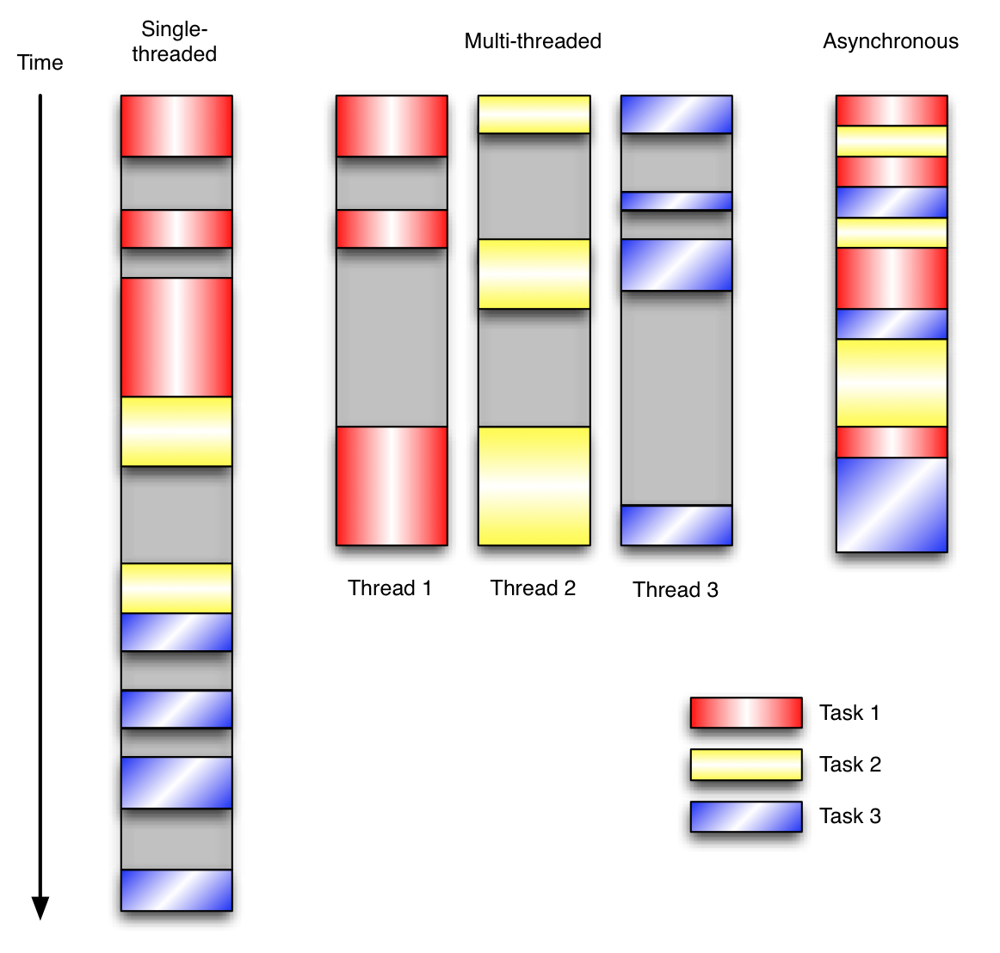

## 学习笔记(week three) -- Scrapy框架深度解析
***
## week three 作业  

* [作业一]()
* [作业二]()

***

## Scrapy框架深度解析  

### Scrapy 并发参数优化原理  
requests 是同步请求，在请求的时候，在等着一件事做完，再做下一件事。scrapy可以是异步，同时处理多个事情。当然是需要调优的。  
***Scrapy参数调优***  
```python
#setting.py 参数调优  
# Configure maximum concurrent(并发) requests performed by Scrapy(default:16)
CONCURRENT_REQUESTS = 32  # 根据服务器性能和目标网站的来调节

# Configure a delay(延迟） for requests for the same website (default:0)
DOENLOAD_DELAY = 3 
# 上面两个配置项就是，一次发送32个请求过去后，需要等待3秒再发下一次请求，防止爬虫爬取过快，被目标网站的反爬虫把IP给封掉


# 下面的设置是更细的设置，则上面的设置就会被失效了。
# The download delay setting will honor only one of: 
CONCURRENT_REQUESTS_PER_DOMAIN = 16 # 如果这个爬虫有多个域名，则这个设置是针对域名来限制。
CONCURRENT_REQUESTS_PER_IP = 16 # 针对IP来限制

```

有些网站会限制最大请求数量，所以需要设置延迟

#### 基于twisted的异步IO框架
多任务模型分为同步模型和异步模型，Scrapy使用的是Twisted模型。***Twisted***是异步变成模型，任务之间相互独立，用户大量I/O密集操作
  

[示例](twisted_demo.py)  

异步是涉及多任务，即可以多个任务同时处理。
单进程  

Twisted是一个事件驱动型的网络引擎。由于事件驱动编程模型在Twisted的设计哲学中占有重要的地位，因此这里有必要花点时间来回顾一下究竟事件驱动意味着什么。  

事件驱动编程是一种编程范式，这里程序的执行流由外部事件来决定。它的特点是包含一个事件循环，当外部事件发生时使用回调机制来触发相应的处理。另外两种常见的编程范式是（单线程）同步以及多线程编程。  

让我们用例子来比较和对比一下单线程、多线程以及事件驱动编程模型。图21.1展示了随着时间的推移，这三种模式下程序所做的工作。这个程序有3个任务需要完成，每个任务都在等待I/O操作时阻塞自身。阻塞在I/O操作上所花费的时间已经用灰色框标示出来了。  
**线程模式**  
  

在单线程同步模型中，任务按照顺序执行。如果某个任务因为I/O而阻塞，其他所有的任务都必须等待，直到它完成之后它们才能依次执行。这种明确的执行顺序和串行化处理的行为是很容易推断得出的。如果任务之间并没有互相依赖的关系，但仍然需要互相等待的话这就使得程序不必要的降低了运行速度。

在多线程版本中，这3个任务分别在独立的线程中执行。这些线程由操作系统来管理，在多处理器系统上可以并行处理，或者在单处理器系统上交错执行。这使得当某个线程阻塞在某个资源的同时其他线程得以继续执行。与完成类似功能的同步程序相比，这种方式更有效率，但程序员必须写代码来保护共享资源，防止其被多个线程同时访问。多线程程序更加难以推断，因为这类程序不得不通过线程同步机制如锁、可重入函数、线程局部存储或者其他机制来处理线程安全问题，如果实现不当就会导致出现微妙且令人痛不欲生的bug。

在事件驱动版本的程序中，3个任务交错执行，但仍然在一个单独的线程控制中。当处理I/O或者其他昂贵的操作时，注册一个回调到事件循环中，然后当I/O操作完成时继续执行。回调描述了该如何处理某个事件。事件循环轮询所有的事件，当事件到来时将它们分配给等待处理事件的回调函数。这种方式让程序尽可能的得以执行而不需要用到额外的线程。事件驱动型程序比多线程程序更容易推断出行为，因为程序员不需要关心线程安全问题。

当我们面对如下的环境时，事件驱动模型通常是一个好的选择：

程序中有许多任务，而且…
任务之间高度独立（因此它们不需要互相通信，或者等待彼此）而且…
在等待事件到来时，某些任务会阻塞。
当应用程序需要在任务间共享可变的数据时，这也是一个不错的选择，因为这里不需要采用同步处理。

网络应用程序通常都有上述这些特点，这使得它们能够很好的契合事件驱动编程模型。  

[Python Twisted 介绍](https://blog.csdn.net/hanhuili/article/details/9389433)  
[Python Twisted 介绍(英文原文)](http://www.aosabook.org/en/twisted.html)  
### 多进程：进程的创建  
多进程，多线程，协程的目的都是希望尽可能多处理任务
产生新的进程可以使用一下方式：
* os.fork()
* multiprocessing.Process()

多进程的第一个问题：进程的父子关系

```python
import os

# a = os.fork()
# print(a)
# print(11111)

# 执行结果：
# 73866
# 11111
# 0
# 11111
# fork函数一旦运行就会生出一条新的进程，2个进程一起执行导致输出了2行 
# 一个是父进程执行的，一个是子进程执行的
```

```python

import time
# 区分父子进程
res = os.fork()
print(f'res = {res}')

if res == 0:
    print(f'我是子进程，我的pid是：{os.getpid()}，我的父进程id是：{os.getppid()}')
else:
    print(f'我是父进程，我的pid是：{os.getpid()}')
    
# fork运行时，会有两个返回值，返回值大于0时，此进程为父进程，且返回值的数字为子进程的PID，当返回值为0时，此进程为子进程
# 注意：父进程结束时，子进程并不会随父进程立刻结束。同样，父进程不会等待子进程执行完。
# 注意：os.fork()无法在windows上运行

```

```python

# 参数
# multiprocessing.Process(group=None, target=None, name=None, args=(), kwargs={})

# - group: 分组，实际上很少使用，
# - target: 表示调用对象，你可以传入方法的名字，或者函数名称
# - name: 别名，相当于给这个进程取一个名字
# - args: 表示调用对象的位置参数元祖，比如target是函数a，他有两个参数m，n，那么args就传入（m，n）即可
# - kwargs：表示调用对象的字典

from multiprocessing import Process


def f(name):
    print(f'hello {name}')

if __name__ == '__main__':
    p = Process(target=f, args=('john',))
    p.start()
    p.join() # 等待子进程结束，父进程才能结束

# join(timeout) # 超过多少秒 子进程不结束，则父进程也会立即结束
# 如果可选参数 timeout 是None（默认值），则该方法将阻塞
# 知道调用join() 方法的进程终止。如果timeout是一个正数，它最多会阻塞 timeout 秒。
# 请注意，如果进程终止或方法超时，则该方法返回 None。
# 检查进程的exitcode以确定它是否终止
# 一个进程可以合并多次
# 进程无法并入自身，因为这会导致死锁。
# 尝试在启动进程之前合并进程是错误的
```


### 多进程：多进程程序调试技巧  

```python
# 显示所涉及的各个进程ID，这是有一个扩展示例

from multiprocessing import Process
import os
import multiprocessing

def debug_info(title):
    print('-'*20)
    print(title)
    print('模块名称', __name__)
    print('父进程：', os.getppid())
    print('子进程：', os.getpid())
    print('-'*20)

def f(name):
    debug_info('function f')
    print('hello', name)


if __name__ == '__main__':
    debug_info('main')
    p = Process(target=f, args=('bob',))
    p.start()

    for p in multiprocessing.active_children():
        print(f'子进程：{p.name} id:{str(p.pid)}')

    print('进程结束')
    print(f'CPU核心数量:{str(multiprocessing.cpu_count())}')

    p.join()


# --------------------
# main
# 模块名称 __main__
# 父进程： 74957
# 子进程： 75744
# --------------------
# 子进程：Process-1 id:75745
# 进程结束
# CPU核心数量:8
# --------------------
# function f
# 模块名称 __main__
# 父进程： 75744
# 子进程： 75745
# --------------------
# hello bob
# 在程序运行时，每一个进程将会占用一个cpu核心的
# 一般创建子进程的数量和cpu核心数量相等的时候，效率相对较高
```

```python
# multiprocessing.Process的run()方法

import os
import time
from multiprocessing import Process

class NewProcess(Process): # 继承Process类，创建一个新类
    def __init__(self, num):
        self.num = num
        super().__init__()

    def run(self): # 重新Process类中的run方法
        while True:
            print(f'我是进程：{self.num}，我的pid：{os.getpid()}')
            time.sleep(1)


for i in range(16):
    p = NewProcess(i)
    p.start()

# 当不给NewProcess指定target时，会默认执行Process类里的run方法，这和指定target效果是一样的，只是将函数封装到类中之后便于理解和调用
```

### 多进程：使用队列实现进程间的通信  
为什么不能再使用变量作为进程间共享数据了？
单个进程当中的变量赋值是在每一个进程的堆栈中，跨进程到另外一个进程中，堆栈信息是不会被传递过去的。这时你对变量赋值等操作，另一个进程是不可能知道的。这时就需要引入新的进程通信机制。
主要共享方式：
* 队列
* 管道
* 共享内存  

资源的抢占：
* 加锁机制


```python
# 全局变量在多个进程中不能共享，在子进程中修改全局变量对父进程中的全局变量没有影响
# 因为父进程在创建子进程时对全局变量做了一个备份，
# 在子进程中的全局变量与子进程的全局变量完全是不同的两个变量
# 全局变量在多个进程中是不能被共享的。

import time
import os
from multiprocessing import Process

num = 1000

def run():
    print(f'我是子进程，PID：{os.getpid()}')
    global num
    num += 1
    print(f'子进程num = {num}')
    print('子进程end')


if __name__ == '__main__':
    print(f'我是父进程，PID：{os.getpid()}')
    num += 2
    p = Process(target=run)
    p.start()
    p.join()
    # 在子进程中修改全局变量num，父进程没有任何变化
    print(f'父进程结束，num = {num}')


# 我是父进程，PID：78309
# 我是子进程，PID：78310
# 子进程num = 1001
# 子进程end
# 父进程结束，num = 1000
```


队列示例：
```python
# multiprocessing 支持进程间的两种通信
# 队列，来自官方文档中的一个简单的demo
# Queue是一个类似queue.Queue的克隆
# 现在有这样的一个需求：我们有两个进程，一个进程负责写（write），一个进程负责读（read）
# 当写的进程写完某部分以后要把数据交给读的进程进行使用
# write将写完数据交给队列，再由队列交给read

from multiprocessing import Process, Queue

def f(q):
    q.put([42, None, 'hello'])


if __name__ == '__main__':
    q = Queue()
    p = Process(target=f, args=(q,))
    p.start()
    print(q.get())
    p.join()


# 如果是多个进程在进行写入的话，会进行阻塞状态，是需要一个写入后才会有下一个再继续写入
# 队列是线程和队列安全的
# 先入先出 
# blocked 

```

```python

import time
import os
from multiprocessing import Process, Queue


def write(w):
    print(f'write process start... pid: {os.getpid()}')
    for m in ['A', 'B', 'C', 'D', 'E', 'F', 'G', 'H', 'I']:
        w.put(m) # 写入队列
        time.sleep(1)
    print('write process end.')


def read1(r):
    print(f'read process-1 start... pid: {os.getpid()}')
    while True: # 阻塞 等待获取write值
        value = r.get(True)
        print(f'i am 1 value = {value}')

    print('read process-1 end.') # 不会执行，直接被干掉了。
    
def read2(r):
    print(f'read process-2 start... pid: {os.getpid()}')
    while True:
        value = r.get(True)
        print(f'i am 2 value = {value}')


if __name__ == '__main__':
    # 父进程创建队列，并传递给子进程
    print(f'parent process start... pid: {os.getpid()}')
    q = Queue()
    w = Process(target=write, args=(q,))
    r1 = Process(target=read1, args=(q,))
    r2 = Process(target=read2, args=(q,))
    w.start()
    r1.start()
    r2.start()

    w.join()
    # r1 和 r2 进程是一个死循环，无法等待其结束，只能强行结束， 写进程结束了，所有读进程也可以结束
    r1.terminate()
    r2.terminate()

    print('parent process end.')


#     parent process start... pid: 79562
# write process start... pid: 79563
# read process-1 start... pid: 79564
# i am 1 value = A
# read process-2 start... pid: 79565
# i am 1 value = B
# i am 2 value = C
# i am 1 value = D
# i am 2 value = E
# i am 1 value = F
# i am 2 value = G
# i am 1 value = H
# i am 2 value = I
# write process end.
# parent process end.
```
### 多进程：管道共享内存
管道
```python
# 管道
# 官方文档
# Pipe() 函数返回一个由管道链接的连接对象，默认情况下是双工的（双向）

from multiprocessing import Process, Pipe

def f(conn):
    conn.send([42, None, 'hello'])
    conn.close()

if __name__ == '__main__':
    parent_conn, child_conn = Pipe()

    p = Process(target=f, args=(child_conn,))
    p.start()

    print(parent_conn.recv())  # prints [42, None, 'hello']
    p.join()

# 返回的两个连接对象是Pipe() 表示管道的两端
# 每个连接对象都有send和recv方法（相互之间）
# 请注意，如果两个进程或两个线程同时尝试读取或写入管道的同一端，则管道中的数据可能会损坏

# 传统的方式的变量是写在自己进程的内存中的，
```
共享内存
```
# 在 进行并发编程时，通常最好尽量避免使用共享状态，
# 共享内存 shared memory可以使用Value Array将数据存储在共享内存映射中
# 这里的 Array和numpy中的不同，它只能是一维，不能是多维的。
# 同样 和 Value 一样，要定义数据类型，否则会报错

from multiprocessing import Process, Value, Array

def f(n, a):
    n.value = 3.1415926
    for i in a:
        a[i] = -a[i]


if __name__ == '__main__':
    num = Value('d', 0.0)
    arr = Array('i', range(10))
    p = Process(target=f, args=(num, arr))

    p.start()
    p.join()

    print(num.value)
    print(arr[:])

# 3.1415926
# [0, -1, -2, -3, -4, -5, -6, -7, -8, -9]

# 创建 num 和 arr 时使用 ‘d’ 和 ‘i’，参数是array模块使用的类型 ‘typecode’：‘d’表示双精度浮点数，‘i’表示有符号整数
# 这些共享对象将是进程和线程安全的
```
### 多进程：锁机制解决资源抢占  
无锁示例：
```python
# 进程锁Lock
# 不加锁

import multiprocessing as mp

import time

def job(v, num, p):
    for _ in range(5):
        time.sleep(0.1) # 暂停0.1秒让输出效果更明显
        v.value += num # v.value获取共享变量值
        print(f'{p}-value = {v.value}')


if __name__ == '__main__':
    v = mp.Value('i', 0) # 定义共享变量 
    p1 = mp.Process(target=job, args=(v, 1, 'p1'))
    p2 = mp.Process(target=job, args=(v, 3, 'p2')) # 设定不同number，看看如何抢夺内存
    p1.start()
    p2.start()
    p1.join()
    p2.join()


# 在上面的代码中我们定义了一个共享变量v，两个进程都可以对它进行操作，
# 在job中，我们想让V每隔0.1秒输出一次累加num的结果，但是两个进程设置的不同累加值，so 接下来看看这两个进程会不会出现冲突
# 进程1和进程在互相抢着使用共享内存
```
加锁示例：
```python
# 进程锁Lock
# 不加锁

import multiprocessing as mp

import time

# 在这里设置进程锁的使用，保证在一个进程在运行时对锁内内容的独占
def job(v, num, l, p):
    l.acquire() #  锁住
    for _ in range(5):
        time.sleep(0.1) # 暂停0.1秒让输出效果更明显
        v.value += num # v.value获取共享变量值
        print(f'{p}-value = {v.value}')
    l.release()


if __name__ == '__main__':
    v = mp.Value('i', 0) # 定义共享变量 
    l = mp.Lock() # 定义一个进程锁
    # 进程锁传入各个进程中
    p1 = mp.Process(target=job, args=(v, 1, l, 'p1'))
    p2 = mp.Process(target=job, args=(v, 3, l, 'p2')) # 设定不同number，看看如何抢夺内存
    p1.start()
    p2.start()
    p1.join()
    p2.join()

# p1-value = 1
# p1-value = 2
# p1-value = 3
# p1-value = 4
# p1-value = 5
# p2-value = 8
# p2-value = 11
# p2-value = 14
# p2-value = 17
# p2-value = 20

# 上面的结果就是进程锁保证进程p1的完整运行，然后才进行了p2进程的运行


# 在某些特定的场景下要共享string类型，方式如下：
from ctypes import c_char_p
str_val = mp.Value(c_char_p, b"Hello World")
```
### 多进程：进程池  
每一个进程都是需要消耗一个逻辑cpu的
### 多线程：创建线程  

### 多线程：线程锁  

### 多线程：队列  

### 多线程：线程池  

### 多线程：GIL 锁与多线程的性能瓶颈  

### 迷你 Scrapy 项目实践  