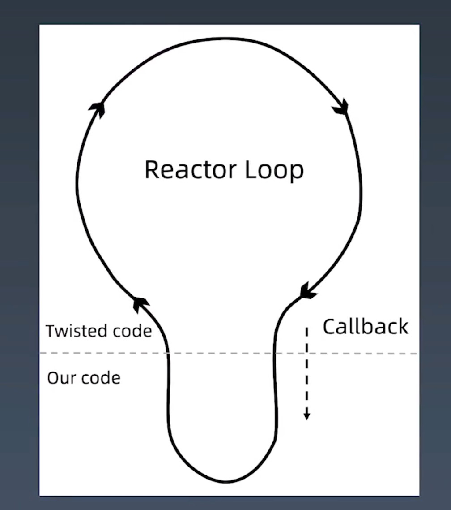

## 学习笔记(week three) -- Scrapy框架深度解析
***
## week three 作业  

* [作业一]()
* [作业二]()

***

## Scrapy框架深度解析  

### Scrapy 并发参数优化原理  
requests 是同步请求，在请求的时候，在等着一件事做完，再做下一件事。scrapy可以是异步，同时处理多个事情。当然是需要调优的。  
***Scrapy参数调优***  
```python
#setting.py 参数调优  
# Configure maximum concurrent(并发) requests performed by Scrapy(default:16)
CONCURRENT_REQUESTS = 32  # 根据服务器性能和目标网站的来调节

# Configure a delay(延迟） for requests for the same website (default:0)
DOENLOAD_DELAY = 3 
# 上面两个配置项就是，一次发送32个请求过去后，需要等待3秒再发下一次请求，防止爬虫爬取过快，被目标网站的反爬虫把IP给封掉


# 下面的设置是更细的设置，则上面的设置就会被失效了。
# The download delay setting will honor only one of: 
CONCURRENT_REQUESTS_PER_DOMAIN = 16 # 如果这个爬虫有多个域名，则这个设置是针对域名来限制。
CONCURRENT_REQUESTS_PER_IP = 16 # 针对IP来限制

```

有些网站会限制最大请求数量，所以需要设置延迟

#### 基于twisted的异步IO框架
多任务模型分为同步模型和异步模型，Scrapy使用的是Twisted模型。***Twisted***是异步变成模型，任务之间相互独立，用户大量I/O密集操作
  

[示例](twisted_demo.py)  

异步是涉及多任务，即可以多个任务同时处理。
单进程  

Twisted是一个事件驱动型的网络引擎。由于事件驱动编程模型在Twisted的设计哲学中占有重要的地位，因此这里有必要花点时间来回顾一下究竟事件驱动意味着什么。  

事件驱动编程是一种编程范式，这里程序的执行流由外部事件来决定。它的特点是包含一个事件循环，当外部事件发生时使用回调机制来触发相应的处理。另外两种常见的编程范式是（单线程）同步以及多线程编程。  

让我们用例子来比较和对比一下单线程、多线程以及事件驱动编程模型。图21.1展示了随着时间的推移，这三种模式下程序所做的工作。这个程序有3个任务需要完成，每个任务都在等待I/O操作时阻塞自身。阻塞在I/O操作上所花费的时间已经用灰色框标示出来了。  
**线程模式**  
  

在单线程同步模型中，任务按照顺序执行。如果某个任务因为I/O而阻塞，其他所有的任务都必须等待，直到它完成之后它们才能依次执行。这种明确的执行顺序和串行化处理的行为是很容易推断得出的。如果任务之间并没有互相依赖的关系，但仍然需要互相等待的话这就使得程序不必要的降低了运行速度。

在多线程版本中，这3个任务分别在独立的线程中执行。这些线程由操作系统来管理，在多处理器系统上可以并行处理，或者在单处理器系统上交错执行。这使得当某个线程阻塞在某个资源的同时其他线程得以继续执行。与完成类似功能的同步程序相比，这种方式更有效率，但程序员必须写代码来保护共享资源，防止其被多个线程同时访问。多线程程序更加难以推断，因为这类程序不得不通过线程同步机制如锁、可重入函数、线程局部存储或者其他机制来处理线程安全问题，如果实现不当就会导致出现微妙且令人痛不欲生的bug。

在事件驱动版本的程序中，3个任务交错执行，但仍然在一个单独的线程控制中。当处理I/O或者其他昂贵的操作时，注册一个回调到事件循环中，然后当I/O操作完成时继续执行。回调描述了该如何处理某个事件。事件循环轮询所有的事件，当事件到来时将它们分配给等待处理事件的回调函数。这种方式让程序尽可能的得以执行而不需要用到额外的线程。事件驱动型程序比多线程程序更容易推断出行为，因为程序员不需要关心线程安全问题。

当我们面对如下的环境时，事件驱动模型通常是一个好的选择：

程序中有许多任务，而且…
任务之间高度独立（因此它们不需要互相通信，或者等待彼此）而且…
在等待事件到来时，某些任务会阻塞。
当应用程序需要在任务间共享可变的数据时，这也是一个不错的选择，因为这里不需要采用同步处理。

网络应用程序通常都有上述这些特点，这使得它们能够很好的契合事件驱动编程模型。  

[Python Twisted 介绍](https://blog.csdn.net/hanhuili/article/details/9389433)  
[Python Twisted 介绍(英文原文)](http://www.aosabook.org/en/twisted.html)  
### 多进程：进程的创建  
多进程，多线程，协程的目的都是希望尽可能多处理任务
产生新的进程可以使用一下方式：
* os.fork()
* multiprocessing.Process()

多进程的第一个问题：进程的父子关系

```python
import os

# a = os.fork()
# print(a)
# print(11111)

# 执行结果：
# 73866
# 11111
# 0
# 11111
# fork函数一旦运行就会生出一条新的进程，2个进程一起执行导致输出了2行 
# 一个是父进程执行的，一个是子进程执行的
```

```python

import time
# 区分父子进程
res = os.fork()
print(f'res = {res}')

if res == 0:
    print(f'我是子进程，我的pid是：{os.getpid()}，我的父进程id是：{os.getppid()}')
else:
    print(f'我是父进程，我的pid是：{os.getpid()}')
    
# fork运行时，会有两个返回值，返回值大于0时，此进程为父进程，且返回值的数字为子进程的PID，当返回值为0时，此进程为子进程
# 注意：父进程结束时，子进程并不会随父进程立刻结束。同样，父进程不会等待子进程执行完。
# 注意：os.fork()无法在windows上运行

```

```python

# 参数
# multiprocessing.Process(group=None, target=None, name=None, args=(), kwargs={})

# - group: 分组，实际上很少使用，
# - target: 表示调用对象，你可以传入方法的名字，或者函数名称
# - name: 别名，相当于给这个进程取一个名字
# - args: 表示调用对象的位置参数元祖，比如target是函数a，他有两个参数m，n，那么args就传入（m，n）即可
# - kwargs：表示调用对象的字典

from multiprocessing import Process


def f(name):
    print(f'hello {name}')

if __name__ == '__main__':
    p = Process(target=f, args=('john',))
    p.start()
    p.join() # 等待子进程结束，父进程才能结束

# join(timeout) # 超过多少秒 子进程不结束，则父进程也会立即结束
# 如果可选参数 timeout 是None（默认值），则该方法将阻塞
# 知道调用join() 方法的进程终止。如果timeout是一个正数，它最多会阻塞 timeout 秒。
# 请注意，如果进程终止或方法超时，则该方法返回 None。
# 检查进程的exitcode以确定它是否终止
# 一个进程可以合并多次
# 进程无法并入自身，因为这会导致死锁。
# 尝试在启动进程之前合并进程是错误的
```


### 多进程：多进程程序调试技巧  

### 多进程：使用队列实现进程间的通信  

### 多进程：管道共享内存

### 多进程：锁机制解决资源抢占  

### 多进程：进程池  

### 多线程：创建线程  

### 多线程：线程锁  

### 多线程：队列  

### 多线程：线程池  

### 多线程：GIL 锁与多线程的性能瓶颈  

### 迷你 Scrapy 项目实践  