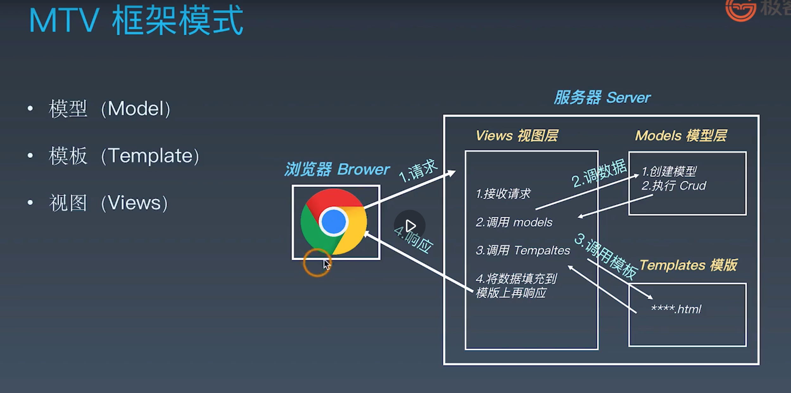

## 学习笔记
***
## week six 作业  

* [作业一]()
* [作业二]()

***

## 开发环境配置
***
[Django 官方文档](https://docs.djangoproject.com/zh-hans/3.0)  

MVC设计模式

MTV 框架模式



***特点***
* 采用了MTV的框架  
* 强调快速开发和代码复用 DRY(Do Not Repeat Yourself)  
* 组件丰富：  
    - ORM(对象关系映射)映射类来构建数据模型  
    - URL 支持正则表达式  
    - 模板可继承  
    - 内置用户认证，提供用户认证和权限功能  
    - admin 管理系统  
    - 内置表单模型、Cache缓存系统、国际化系统等  

Django的安装：  
`pip install --upgrade django==2.2.13` 安装指定的版本  
检查是否安装成功 
```python
import django

print(django.get_version())
# 2.2.13
```
如果是输出对应的版本号，则表示安装成功

(LTS) 对当前的软件版本会长期支持

## 创建项目和目录结构
****
1、创建Django的项目  
2、创建应用程序  
3、启动程序  

创建项目：`django-admin startproject MyDjango`，创建好的目录结构：
```python

MyDjango/
    -manage.py # 命令行工具
    -MyDjango/
        -__init__.py
        -settings.py  # 项目的配置文件
        -urls.py
        -wsgi.py
```
创建应用程序：`python manage.py startapp index`，目录结构：
```python
index/
    -admin.py # 管理后台
    -apps.py # 当前app配置文件
    -migrations/ # 数据库迁移文件
        - __init__.py
    -models.py # 模型
    -tests.py # 自动化测试
    -views.py # 视图
```
使用 `python manage.py help` 命令查看该工具的具体功能。

使用 `python manage.py runserver` 命令启动程序，默认运行的是 `127.0.0.1:8000` ，`python manage.py runserve 0.0.0.0:80` 更改运行端口，使用 `CONTROL-C` 退出程序。

## 解析settings.py主要配置文件
***
配置文件包括：
* 项目路径  
* 密钥  
* 域名访问权限  
* App列表  
* 静态资源，包括CSS，JavaScript图片等  
* 模板文件  
* 数据库配置  
* 缓存  
* 中间件  

主要对 `INSTALLED_APPS` 配置添加自己的应用程序和 `DATABASES` 改成mysql
## urls调度器
***
主要用于接收用户的请求信息，附带一些django自己需要的信息，有django中间件。

## 模块和包
        
## 让URL支持变量
        
## URL正则和自定义过滤器

## view视图快捷方式
        
## 使用ORM创建数据表
        
## ORM API
        
## Django模板开发
        
## 展示数据库中的内容
        
## 豆瓣页面展示功能的需求分析
        
## urlconf与models 配置
        
## views视图的编写
        
## 结合bootstrap模板进行开发
        
## 如何阅读Django的源代码

## manage.py源码分析

        